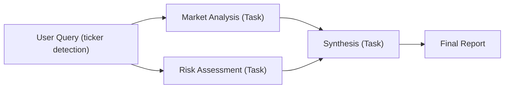

# Enhancing Workflow Modularity: A Comparative Analysis

Links for reference: [ControlFlow Welcome](https://controlflow.ai/welcome), [Concepts](https://controlflow.ai/concepts/concepts), [Tasks](https://controlflow.ai/concepts/tasks), [Agents](https://controlflow.ai/concepts/agents), [Flows](https://controlflow.ai/concepts/flows), [Patterns: running-tasks](https://controlflow.ai/patterns/running-tasks), [task-results](https://controlflow.ai/patterns/task-results), [tools](https://controlflow.ai/patterns/tools), [dependencies](https://controlflow.ai/patterns/dependencies), [instructions](https://controlflow.ai/patterns/instructions), [examples: multi-llm](https://controlflow.ai/examples/features/multi-llm), [examples: tools](https://controlflow.ai/examples/features/tools), [examples: early-termination](https://controlflow.ai/examples/features/early-termination), [glossary: task-orchestration](https://controlflow.ai/glossary/task-orchestration), [flow-orchestration](https://controlflow.ai/glossary/flow-orchestration), [workflow](https://controlflow.ai/glossary/workflow), [flow-engineering](https://controlflow.ai/glossary/flow-engineering)

---

## Slide 1: Introduction

**Title:** Enhancing Workflow Modularity: A Comparative Analysis

**Content:**
- Why modularity matters for AI workflow systems (scale, reuse, safety, velocity).
- FINTEL v2 is a config-driven, ControlFlow-powered engine for multi-agent financial analysis.
- Case study focus: comparing FINTEL v2’s YAML-first approach vs ControlFlow’s programmatic primitives.

---

## Slide 2: The Hook

**Title:** All Behavior Lives in YAML; Python Is the Engine

**Content:**
- In FINTEL v2, agents, tools, and workflows are declared in YAML under `backend/config/`.
- Python implements the execution engine and validation; edits happen in YAML.

**Example (workflow excerpt):**
```yaml
# backend/config/workflow_config.yaml (excerpt)
workflows:
  quick_stock_analysis:
    name: "Quick Stock Analysis"
    description: "Fast, high-level analysis of a specific stock for a go/no-go investment decision."
    agents:
      - name: "MarketAnalyst"
        role: "market_analysis"
        required: true
        fallback: "FinancialAnalyst"
        tools: ["get_market_data", "get_company_overview", "get_mock_news"]
      - name: "RiskAssessment"
        role: "risk_assessment"
        required: true
        fallback: "FinancialAnalyst"
        tools: ["get_market_data", "get_mock_analyst_ratings"]
      - name: "Summarizer"
        role: "synthesis"
        required: true
        tools: []
        dependencies: ["market_analysis", "risk_assessment"]

settings:
  default_workflow: "quick_stock_analysis"
  enable_fallback_agents: true
```

---

## Slide 3: Core Concepts

**Title:** Core Concepts: Tasks, Agents, and Flows

**Content:**
- **Tasks:** Discrete, typed units of work (Pydantic models for structured results).
- **Agents:** Configurable AI entities with tools and capabilities, created from YAML.
- **Flows:** ControlFlow orchestrations constructed from YAML roles and dependencies.

**Visual Aid:**


---

## Slide 4: Tasks

**Title:** Tasks: Definition and Implementation

**Content:**
- **ControlFlow:** Define tasks with `cf.Task(objective, instructions, result_type)` and wire dependencies.
- **FINTEL v2:** Tasks are derived from workflow roles in YAML; the engine creates typed `cf.Task`s and wires dependencies.

**ControlFlow (reference):**
```python
import controlflow as cf

task = cf.Task(
    objective="Write a poem about AI",
    instructions="Write four lines that rhyme",
    result_type=str
)
```

**FINTEL v2 (typed results + construction):**
```python
# backend/workflows/config_driven_workflow.py (excerpt)
class InvestmentAnalysis(BaseModel):
    ticker: str
    market_analysis: str
    sentiment: Literal["positive", "negative", "neutral"]
    recommendation: str
    confidence: float
    key_insights: List[str]
    risk_assessment: str

tasks[role] = cf.Task(
    objective=prompt,
    instructions=instructions,
    agents=[agents[role]],
    context=workflow_context,
    result_type=result_type,
    name=f"task_{role}"
)
```

---

## Slide 5: Agents

**Title:** Agents: Configuration and Flexibility

**Content:**
- **ControlFlow:** Agents configured programmatically (model, tools, instructions).
- **FINTEL v2:** Agents declared in YAML with tools/capabilities; factory builds ControlFlow agents with validation and fallbacks.

**ControlFlow (reference):**
```python
import controlflow as cf

agent = cf.Agent(
    name="Data Analyst",
    instructions="Perform data analysis tasks.",
    tools=[...],
    model="openai/gpt-4o"
)
```

**FINTEL v2 (YAML):**
```yaml
# backend/config/agents.yaml (excerpt)
agents:
  MarketAnalyst:
    name: "MarketAnalyst"
    tools: ["detect_stock_ticker", "get_market_data", "get_company_overview"]
    capabilities: ["market_analysis", "ticker_detection"]
    required: false
    enabled: true
```

**FINTEL v2 (factory creates ControlFlow agent):**
```python
# backend/agents/factory.py (excerpt)
agent = cf.Agent(
    name=agent_name,
    model=model_config,
    tools=tools,
    instructions=agent_info.get("instructions", f"You are {agent_name}.")
)
```

---

## Slide 6: Flows

**Title:** Flows: Orchestrating Tasks and Agents

**Content:**
- **ControlFlow:** Use `@cf.flow` to define flows that call tasks and agents.
- **FINTEL v2:** `execute()` is a ControlFlow flow; dependencies come from YAML and are applied via `add_dependency`.

**ControlFlow (reference):**
```python
import controlflow as cf

@cf.flow
def demo_flow(topic: str = None) -> str:
    name = cf.run("Get the user's name")
    return cf.run("Write a poem about the user", context=dict(topic=topic))
```

**FINTEL v2 (flow + deps):**
```python
# backend/workflows/config_driven_workflow.py (excerpt)
@cf.flow
def execute(self, query: str, provider: str = "openai", **kwargs):
    ...
    # From YAML deps: tasks[child].add_dependency(tasks[parent])
    tasks[role].add_dependency(tasks[dep_role])
```

---

## Slide 7: Extending the System

**Title:** Extending the System: Add Tools, Update Agents, Tweak Dependencies

**Content:**
- All edits are YAML-only; the engine and UI reflect changes automatically after a backend restart.

**Add a tool (tools.yaml):**
```yaml
# backend/config/tools.yaml (new entry example)
tools:
  calculate_pe_ratio:
    name: "calculate_pe_ratio"
    description: "Calculate P/E ratio for a given stock."
    category: "analysis"
    function: "calculate_pe_ratio"
    class: null
    api_key_required: null
    enabled: true
    examples:
      - "calculate_pe_ratio(ticker='AAPL')"
```

**Assign the tool to an agent (agents.yaml):**
```yaml
# backend/config/agents.yaml (excerpt)
agents:
  FinancialAnalyst:
    tools:
      - "calculate_pe_ratio"
      - "get_market_data"
```

**Tweak workflow dependencies (workflow_config.yaml):**
```yaml
# backend/config/workflow_config.yaml (excerpt)
workflows:
  quick_stock_analysis:
    agents:
      - name: "Summarizer"
        role: "synthesis"
        required: true
        tools: []
        dependencies: ["market_analysis", "risk_assessment"]  # edit here
```

---

## Slide 8: Multi-LLM Support

**Title:** Multi-LLM Support by Configuration

**Content:**
- Providers are pluggable (OpenAI, Google, Local) via `ProviderFactory` and environment.
- Select provider per request (`provider` field) or via `DEFAULT_PROVIDER` in `.env`.

**Provider map:**
```python
# backend/providers/factory.py (excerpt)
_providers = {
  'openai': OpenAIProvider,
  'google': GeminiProvider,
  'local':  LocalProvider,
}
```

**.env keys (excerpt):**
```env
OPENAI_API_KEY=sk-xxx
GOOGLE_API_KEY=xxx
ALPHA_VANTAGE_API_KEY=xxx
FRED_API_KEY=xxx
# DEFAULT_PROVIDER=openai|google|local
```

---

## Slide 9: Observability and Monitoring

**Title:** Deep Observability: Events, Graph, and APIs

**Content:**
- ControlFlow handler captures `task_start/success/failure`, `agent_message`, `agent_tool_call`, and `tool_result`.
- UI visualizes nodes/edges live; Agent Trace shows tool inputs/outputs and reasoning.
- Backend exposes health/registry/workflow status APIs.

**Event handler (excerpt):**
```python
# backend/utils/monitoring.py (excerpt)
class FintelEventHandler(Handler):
    def on_task_start(self, event: TaskStart): ...
    def on_task_success(self, event: TaskSuccess): ...
    def on_task_failure(self, event: TaskFailure): ...
    def on_agent_message(self, event: AgentMessage): ...
    def on_agent_tool_call(self, event: AgentToolCall): ...
    def on_tool_result(self, event: ToolResult): ...
```

**Core APIs (selected):**
- `GET /api/health`
- `GET /api/registry/{health|status|validation|summary}`
- `GET /api/registry/tools`
- `GET /api/workflows`, `GET /api/workflow-configs`
- `POST /api/run-workflow`, `GET /api/workflow-status/{id}`, `GET /api/workflow-stream/{id}`

---

## Slide 10: Conclusion

**Title:** The Power of Modularity

**Content:**
- YAML as Single Source of Truth → faster edits, safer changes, clearer reviews.
- Typed task results → reliable downstream processing and UI.
- Pluggable providers + validation → portability and resilience.
- Observability → confidence in production.

---

## Appendix: Live Demo (5–7 minutes)

1) Start services
```bash
npm run dev
```

2) Show config-driven discovery
- `GET /api/workflows`, `GET /api/workflow-configs`, `GET /api/registry/tools`

3) Run a workflow
```bash
curl -X POST http://localhost:5001/api/run-workflow \
  -H 'Content-Type: application/json' \
  -d '{"query":"Analyze AAPL for a quick go/no-go","provider":"openai","workflow_type":"quick_stock_analysis"}'
```

4) Make a tiny YAML change
- Add a tool in `backend/config/tools.yaml` and assign it to `MarketAnalyst` in `backend/config/agents.yaml`.
- Restart backend and re-run; show new tool calls in Agent Trace and updated graph.


